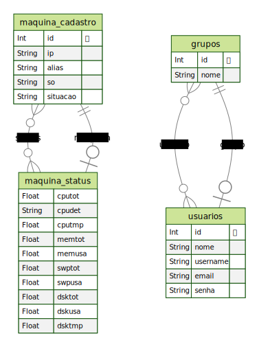

# Machine Viewer

---

Repostório dedicado ao código do **Machine Viewer**, uma aplicação para administração e análise de máquinas em rede.

## Visão geral

O Machine Viewer é uma aplicação que tem por objetivo permitir a visualização do status de máquinas em rede. Ele funciona utiliza uma API em express que gerencia as requisições e um cliente em Python, que também está disponibilizado no repositório.

## Estrutura do projeto

```bash
machine-viewer/
├── backend/
│   ├── api/
│   ├── clients/
│   ├── src/
│   └── utils/
├── frontend/
│   ├── assets/
│   ├── css/
│   ├── js/
│   ├── lib/
│   ├── pages/
│   └── public/
├── preview.png
└── README.md
```

## Estrutura do banco



## Funcionamento

Ao executar a API, irá armazenar o endereço IP escolhido pelo usuário (*127.0.0.1 caso o usuário não escolha nenhum*) em um arquivo de configuração `machine-viewer/backend/config/ip_addr`, esse arquivo será acessado pelo front-end para realizar as consultas;
A API, então, ficará escutando na porta 5900 requisições do tipo `POST`, `GET`, `PUT` e `DELETE` e ela tratará cadastro de máquinas e usuários.
O cliente, por sua vez, irá pedir um endereço IP para conectar-se (*usando o 127.0.0.1 caso não seja passado nenhum*), ele então enviará os dados de cadastro antes de começar a enviar os dados do status da máquina.

## Informações coletadas

O cliente coletará e enviará para a API as seguintes informações utilizando a biblioteca do Python psutil:

* Sistema operacional;
* Endereço IP da máquina;
* Uso médio da CPU;
* Uso detalhado de cada núcleo da CPU;
* Temperatura da CPU (indisponível em windows);
* Total de Memória RAM e Swap;
* Total usado de RAM e Swap;
* Total de armazenamento de disco;
* Total utilizado do armazenamento;
* Temperatura do Disco (indisponpivel em windows);

## Requisitos e dependências

Segue a versão requisitada do Node.js e do Python, juntamente com as dependências para execução da aplicação e do cliente.

### API

* [Node.js 18.19.1](https://nodejs.org/pt/blog/release/v18.19.1)
* [package.json](backend/src/package.json)

### Cliente

* [Python 3.12.3](https://www.python.org/downloads/release/python-3123/)
* [requirements.txt](backend/clients/requirements.txt)

## Execução

Para executar a **API** é necessário siga os seguintes passos:

1. Clone o [repositório](https://github.com/joaoweslley1/machine-viewer.git) e instale as dependências;
2. Navegue até o diretório `machine-viewer/backend/src/` e execute o comando `node index.js`;

Para o **cliente**:

1. Clone o [repositório](https://github.com/joaoweslley1/machine-viewer.git) e instale as dependências;
2. Execute o comando `python3 client.py` no diretório `machine-viewer/backend/clients/`.

## Capturas de tela

Página inicial:
    

Página de detalhamento:
    